 

### 01 — About

Front-end developer focused on software that's simple, scalable, and solves real problems. Presently occupied with AI automation and cybersecurity, and contributing to open source in the space between.

---

### 02 — Focus

- Building useful software
- Learning AI & automation
- Exploring cybersecurity

---

### 03 — Stack

**Languages** · `Python` `JavaScript` `TypeScript` `C++` `C`

**Frontend** · `React` `HTML` `CSS` `Tailwind`

**Tools** · `Node.js` `Git` `Docker` `Linux` `VS Code` `Figma`

---

### 04 — Activity

<!--START_SECTION:activity-->
<!--END_SECTION:activity-->

---

### 05 — Contribution record

<picture>
  <source media="(prefers-color-scheme: dark)" srcset="https://raw.githubusercontent.com/BugBasherX/BugBasherX/output/github-contribution-grid-snake-dark.svg"/>
  <source media="(prefers-color-scheme: light)" srcset="https://raw.githubusercontent.com/BugBasherX/BugBasherX/output/github-contribution-grid-snake.svg"/>
  
</picture>

---

### 06 — Connect

[GitHub](https://github.com/BugBasherX) · [LinkedIn](https://linkedin.com/in/bugbasherx) · [Email](mailto:d3v.yuvii@gmail.com)

 

<i>Code. Learn. Build. Repeat.</i>
