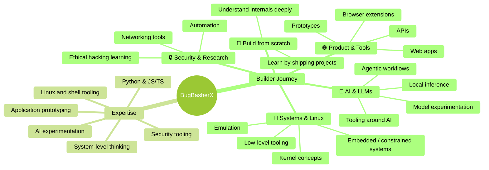

  

  

  
  &nbsp;&nbsp;
  
  &nbsp;&nbsp;
  
  &nbsp;&nbsp;
  

 

  🚀 <strong>Explore more:</strong> <a href="https://yubrajkurmi.com.np" target="_blank" rel="noreferrer">https://yubrajkurmi.com.np</a>

 

  

I build things from the ground up: systems, tools, AI experiments, and product ideas that turn curiosity into working projects.

My work is focused on:
- Linux, kernels, and low-level systems
- local AI / LLM experimentation
- web and browser-based tools
- project-based learning and open-source exploration
- cybersecurity and security tooling

 

##  Tech Arsenal

### 🔧 Core Stack

### 🤖 AI & Local Models

### 🔐 Security & Tooling

  
  
  
  
  

 

##  What I’m Into

- 🧠 AI experimentation and local inference
- 🐧 Linux, system internals, and low-level tooling
- 🧱 Rebuilding systems from scratch to understand how they work
- 🌐 Browser tools, web apps, and product-focused prototypes
- 🔍 Security research, tooling, and ethical exploration
- 📚 Open-source and project-based learning

---

### 🧭 Journey & Expertise Map

```mermaid
%%{init: {'theme':'forest', 'themeVariables': { 'background': 'transparent' }}}%%
mindmap
  root((BugBasherX))
    Builder Journey
      🧱 Build from scratch
        Understand internals deeply
        Learn by shipping projects
      🐧 Systems & Linux
        Kernel concepts
        Low-level tooling
        Emulation
        Embedded / constrained systems
      🤖 AI & LLMs
        Local inference
        Model experimentation
        Agentic workflows
        Tooling around AI
      🌐 Product & Tools
        Browser extensions
        Web apps
        APIs
        Prototypes
      🔒 Security & Research
        Networking tools
        Ethical hacking learning
        Automation
    Expertise
      System-level thinking
      Python & JS/TS
      Linux and shell tooling
      AI experimentation
      Application prototyping
      Security tooling
```

---

##  GitHub Analytics

  

  

 

### 📫 Let’s build something interesting.

**🙏 From [BugBasherX](https://github.com/BugBasherX) with ❤️**

