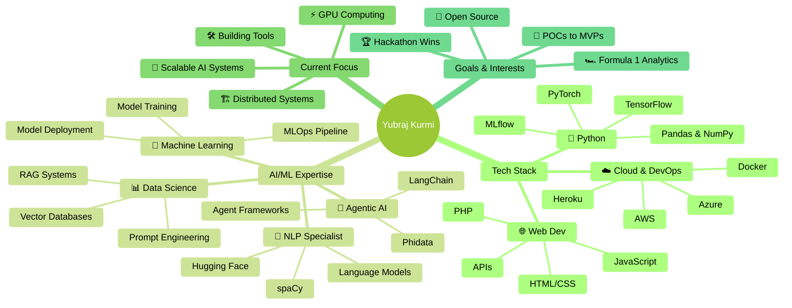

  

&nbsp;&nbsp;

&nbsp;&nbsp;

&nbsp;&nbsp;

 

🚀 <strong>Explore more on personal website:</strong> <a href="https://yubrajkurmi.com.np" target="_blank">https://yubrajkurmi.com.np</a>

 

<table style="width: 100%; table-layout: fixed;">
<tr>
<td colspan="2" align="center">

  
</td>
</tr>
<tr>
<td width="50%" valign="top" style="padding: 10px; word-wrap: break-word;">
 

 

 

##  Tech Arsenal

### 🌐 Web Development, Tools & Cloud Platforms

### 🧠 CyberSecurity and Pentesting

 

### 🎯 Current Focus

---

### 🧠 My Journey & Expertise Map

```mermaid
%%{init: {'theme':'forest', 'themeVariables': { 'background': 'transparent' }}}%%
mindmap
  root((Yubraj Kurmi))
    Tech Stack
      🐍 Python
        PyTorch
        TensorFlow
        Pandas & NumPy
        MLflow
      🌐 Web Dev
        PHP
        JavaScript
        HTML/CSS
        APIs
      ☁️ Cloud & DevOps
        AWS
        Azure
        Docker
        Heroku
    AI/ML Expertise
      🤖 Machine Learning
        Model Training
        Model Deployment
        MLOps Pipeline
      🧠 NLP Specialist
        spaCy
        Hugging Face
        Language Models
      🔗 Agentic AI
        LangChain
        Phidata
        Agent Frameworks
      📊 Data Science
        Vector Databases
        RAG Systems
        Prompt Engineering
    Current Focus
      🔬 Scalable AI Systems
      ⚡ GPU Computing
      🏗️ Distributed Systems
      🛠️ Building Tools
    Goals & Interests
      🏎️ Formula 1 Analytics
      🏆 Hackathon Wins
      📝 POCs to MVPs
      💎 Open Source
```

---

##  GitHub Analytics

  
  

  

 

### 📫 Let's Connect & Build Something Amazing Together!

*"I focus on what matters: design, functionality, user experience, and attention to detail"*

**🙏 From [YubrajKurmi](https://github.com/YubrajKurmi) with ❤️**

